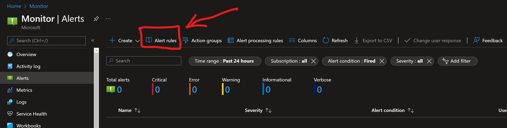
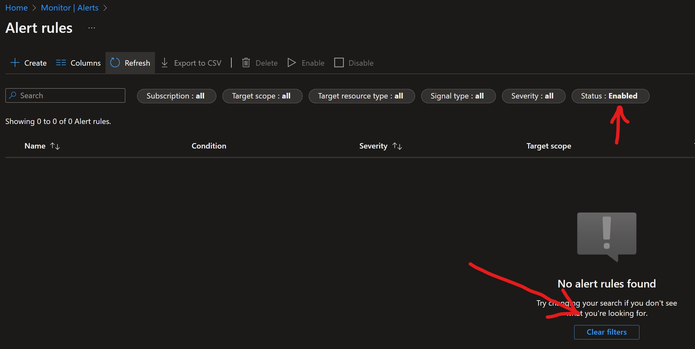
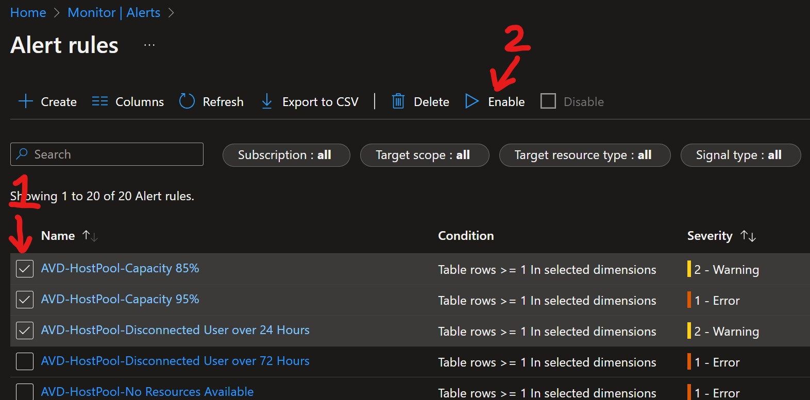

[Home](./README.md) | [PostDeployment](./PostDeploy.md) | [How to Change Thresholds](./ChangeAlertThreshold.md) | [Alert Query Reference](./AlertQueryReference.md) | [Excel List of Alert Rules](https://github.com/JCoreMS/AVDAlerts/raw/main/references/alerts.xlsx)

# View/ Enable Alerts Deployed

1. Open the [Alerts Azure Portal Page](https://portal.azure.com/#blade/Microsoft_Azure_Monitoring/AzureMonitoringBrowseBlade/alertsV2)  
2. Click on the "Alert rules" section at the top of the page.  
  
3. Initially the list of alert rules may be filtered out or appear missing.  Simply change the filter to include "disabled" or click the "Clear filters" option.  
  
4. Select the check box next to each you would like to enable and click "Enable" at the top of the page.  
  